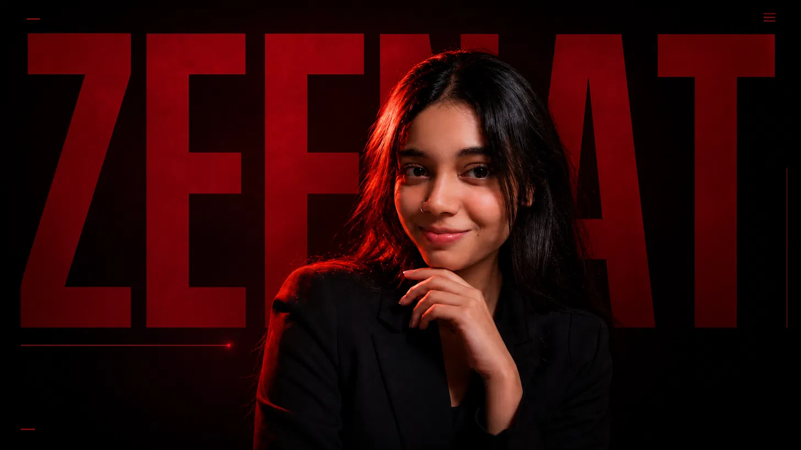

# Zeenat Ansari — Portfolio Website

A cinematic, editorial personal portfolio built with plain HTML/CSS/JS, GSAP, and Lenis smooth scroll. No build step, no framework — just open it in a browser.

**Live sections:** Hero · About · Currently Working On · Education · Skills · Projects · Academic Performance · GitHub · Experience · Achievements · Contact

---

## 📁 Folder Structure

```
zeenat-portfolio/
├── index.html          ← everything (HTML + CSS + JS in one file)
├── assets/
│   └── zeenat-hero.png ← your hero portrait
└── README.md            ← this file
```

**Keep `index.html` and the `assets` folder together, in the same directory, at all times.** If you move one without the other, the hero image will break.

---

## 🚀 Running It

No installation, no build tools. Just double-click `index.html` and it opens in your default browser.

To host it live, use any static hosting provider and upload the whole folder (not just `index.html`):

- **Netlify** — drag and drop the `zeenat-portfolio` folder onto [app.netlify.com/drop](https://app.netlify.com/drop)
- **Vercel** — `vercel deploy` from inside the folder, or connect a GitHub repo
- **GitHub Pages** — push the folder to a repo, enable Pages in Settings, point it at the root

---

## 🎨 Tech Stack

| Purpose | Library |
|---|---|
| Structure & styling | Plain HTML5 + CSS3 (CSS variables, no framework) |
| Fonts | Bebas Neue, Space Grotesk, Inter (Google Fonts) |
| Scroll-triggered animation | [GSAP](https://gsap.com/) + ScrollTrigger |
| Smooth scrolling | [Lenis](https://lenis.darkroom.engineering/) |

All loaded via CDN (`cdnjs.cloudflare.com` / `fonts.googleapis.com`) — no `npm install` needed. This also means you need an internet connection for fonts/animations to load correctly.

---

## ✏️ Customization Guide

### 1. Swap the hero photo
Replace `assets/zeenat-hero.png` with your own image, **keeping the exact same filename** — or update the path in `index.html`:
```html

```
(appears once, in the `<section class="hero">` block)

### 2. Hook up your resume
Currently the "Download Resume" buttons show a placeholder alert. To wire up a real PDF:
1. Add your resume file to the project, e.g. `assets/resume.pdf`
2. In `index.html`, find this script block near the bottom:
   ```js
   ['resumeBtnNav','resumeBtnHero','resumeBtnContact'].forEach(id=>{
     const el = document.getElementById(id);
     if(el) el.addEventListener('click', (e)=>{
       e.preventDefault();
       alert('Add your resume PDF to the project and link it here to enable downloads.');
     });
   });
   ```
3. Replace it with:
   ```js
   ['resumeBtnNav','resumeBtnHero','resumeBtnContact'].forEach(id=>{
     const el = document.getElementById(id);
     if(el) el.setAttribute('href', 'assets/resume.pdf');
     if(el) el.setAttribute('download', '');
   });
   ```

### 3. Update contact links
Search for these in `index.html` (inside `<section id="contact">`) and replace with your real details:
```html
<a href="mailto:zeenat.ansari@example.com">...</a>
<a href="https://github.com">...</a>
<a href="https://linkedin.com">...</a>
<a href="https://instagram.com">...</a>
```

### 4. Contact form
The form currently just shows a confirmation alert (no backend). To make it actually send you messages, connect it to a form service like [Formspree](https://formspree.io/) or [Web3Forms](https://web3forms.com/) — both offer a free tier with no server required. Replace the `onsubmit` handler on the `<form class="contact-form">` element with an action pointing to your form endpoint.

### 5. Connect live GitHub / LeetCode stats
The GitHub section currently uses placeholder numbers and a static contribution-graph pattern. To make it live:
- Swap in a service like [GitHub Readme Stats](https://github.com/anuraghazra/github-readme-stats) (image-based, easiest) or call the GitHub REST/GraphQL API directly with JavaScript
- For LeetCode, similar community APIs exist (e.g. `leetcode-stats-api`)

### 6. Add a new project card
Copy one `<article class="project">...</article>` block inside `<section id="projects">`, edit the title/description/tech stack/links.

### 7. Add a new achievement
Copy one `.t-item` block inside `<section id="achievements">` → `.timeline`.

### 8. Colors & typography
All core design tokens live at the top of the `<style>` block:
```css
:root{
  --bg:#090909;        /* background */
  --accent:#C1121F;     /* crimson accent */
  --text:#F5F3F0;       /* primary text */
  --text-dim:#8c8c8c;   /* secondary text */
}
```
Change these and the whole site updates consistently.

---

## ♿ Accessibility & Performance Notes

- Respects `prefers-reduced-motion` — animations are disabled for users who request it
- Semantic HTML (`<header>`, `<nav>`, `<section>`, `<article>`, `<footer>`)
- All interactive elements have visible focus states
- Images use `loading="eager"` only for the hero (above the fold); consider `loading="lazy"` if you add more images below the fold
- Fonts and scripts load from CDNs — for best performance, consider self-hosting fonts/scripts in production

---

## 📌 Known Placeholders (things to replace before going fully live)

- [ ] Resume PDF not yet linked
- [ ] Email / GitHub / LinkedIn / Instagram are placeholder values
- [ ] GitHub contribution graph and stats are static placeholders
- [ ] Contact form doesn't send anywhere yet (no backend connected)
- [ ] Project case-study links (`GitHub` / `Live Demo` buttons) point to `#`

---

© 2026 Zeenat Ansari — Designed & Developed by Zeenat Ansari
